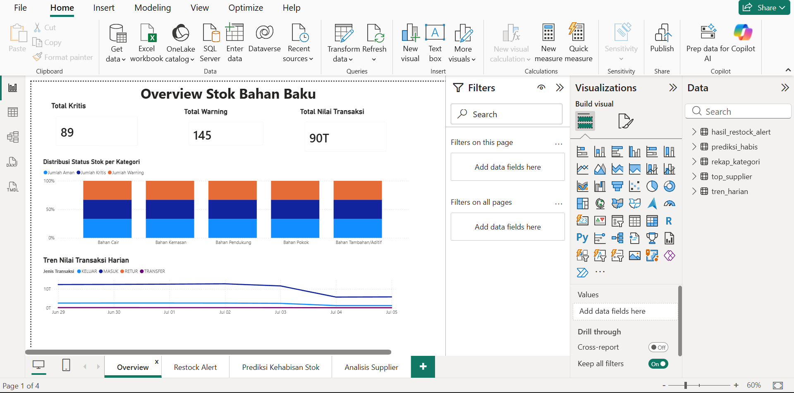

# Inventory Management Analysis — FMCG Raw Material Restock Alert System

Simulasi sistem monitoring stok bahan baku skala enterprise (FMCG/manufaktur besar), dari **generate data sintetis → modeling data (star schema) → analisis SQL dengan DuckDB → dashboard interaktif di Power BI**.

Project ini mensimulasikan skenario nyata: bagaimana perusahaan manufaktur besar (5.000+ SKU bahan baku, ratusan gudang & supplier) memantau stok bahan baku secara real-time untuk mencegah kerugian akibat kehabisan stok (stockout) maupun kelebihan pembelian.

---

## 📌 Ringkasan Temuan (Key Insights)

Dari analisis 500.000 transaksi dalam periode 1 minggu (29 Jun – 5 Jul 2026):

- **89 dari 5.000 bahan baku (±1,8%)** berstatus **KRITIS** — stok bersih sudah di bawah batas aman (safety stock)
- **145 bahan baku** berstatus **WARNING** — mendekati batas minimum
- Bahan baku paling mendesak diperkirakan **habis dalam 7 hari** berdasarkan rata-rata pemakaian mingguan
- Transaksi **KELUAR** mendominasi (55,1%) dibanding **MASUK** (39,9%), sesuai pola operasional pabrik yang menarik bahan tiap hari kerja sementara pembelian dari supplier lebih periodik
- Volume transaksi turun ±50% di akhir pekan (Sabtu–Minggu) dibanding hari kerja, mencerminkan pola operasional yang realistis

---

## 🛠️ Tech Stack

| Tools | Kegunaan |
|---|---|
| **Python** (pandas, numpy, faker) | Generate data sintetis skala enterprise |
| **DuckDB** | Query engine analitik (OLAP) untuk data skala besar |
| **SQL** | Transformasi, agregasi, dan analisis data |
| **Power BI** | Dashboard interaktif & visualisasi |

---

## 🗂️ Struktur Data (Star Schema)

Project ini menggunakan pendekatan **star schema**, pola standar data warehouse di industri — satu **fact table** (transaksi) dikelilingi beberapa **dimension table** (data referensi).

```
                    ┌─────────────────┐
                    │   dim_bahan     │
                    │  (5.000 SKU)    │
                    └────────┬────────┘
                             │
┌──────────────┐   ┌────────┴────────┐
│ dim_supplier  │───│ fact_transaksi  │
│ (implisit via │   │  (500.000 baris)│
│  supplier_id) │   └────────┬────────┘
└──────────────┘             │
                    ┌────────┴────────┐
                    │  dim_gudang     │
                    │ (implisit via   │
                    │  gudang_id)     │
                    └─────────────────┘
```

**`fact_transaksi`** (14 kolom) — tabel transaksi masuk/keluar bahan baku:

| Kolom | Tipe | Keterangan |
|---|---|---|
| transaksi_id | BIGINT | ID unik transaksi |
| tanggal | DATE | Tanggal transaksi |
| waktu | TIME | Jam transaksi |
| bahan_id | BIGINT | FK ke dim_bahan |
| supplier_id | BIGINT | ID supplier |
| gudang_id | BIGINT | ID gudang |
| jenis_transaksi | VARCHAR | MASUK / KELUAR / TRANSFER / RETUR |
| jumlah | DOUBLE | Kuantitas |
| satuan | VARCHAR | kg / liter / pcs / dus |
| harga_satuan | BIGINT | Harga per unit |
| total_nilai | DOUBLE | jumlah × harga_satuan |
| nomor_referensi | VARCHAR | No. PO / WO / Transfer / Retur |
| user_input_id | BIGINT | ID user yang input |
| status_approval | VARCHAR | APPROVED / PENDING / REJECTED |

**`dim_bahan`** — master data bahan baku:

| Kolom | Tipe | Keterangan |
|---|---|---|
| bahan_id | BIGINT | ID unik bahan (PK) |
| nama_bahan | VARCHAR | Nama bahan baku |
| kategori | VARCHAR | Bahan Pokok / Kemasan / Aditif / Cair / Pendukung |
| satuan | VARCHAR | Satuan pengukuran |
| stok_minimum | BIGINT | Batas aman (safety stock) |
| stok_maksimum | BIGINT | Kapasitas maksimum gudang |

---

## ⚙️ Cara Reproduksi

### 1. Install dependencies

```bash
pip install pandas numpy faker duckdb
```

### 2. Generate data sintetis

```bash
python scripts/generate_transaksi_bahan.py   # menghasilkan transaksi_bahan_1minggu.csv (500.000 baris)
python scripts/generate_dim_bahan.py          # menghasilkan dim_bahan.csv (5.000 baris)
```

### 3. Load ke DuckDB

```sql
CREATE TABLE fact_transaksi AS
SELECT * FROM 'transaksi_bahan_1minggu.csv';

CREATE TABLE dim_bahan AS
SELECT * FROM 'dim_bahan.csv';
```

### 4. Jalankan query analisis (lihat folder `/sql`)

### 5. Export hasil ke CSV, load ke Power BI untuk visualisasi

---

## 📊 Query Analisis Utama

### A. Distribusi jenis transaksi

```sql
SELECT jenis_transaksi, COUNT(*) AS jumlah,
       ROUND(COUNT(*) * 100.0 / SUM(COUNT(*)) OVER (), 2) AS persentase
FROM fact_transaksi
GROUP BY jenis_transaksi
ORDER BY jumlah DESC;
```

### B. Restock Alert — deteksi bahan kritis/warning

```sql
COPY (
    SELECT
        d.bahan_id, d.nama_bahan, d.kategori, d.satuan,
        d.stok_minimum, d.stok_maksimum,
        SUM(CASE WHEN f.jenis_transaksi = 'MASUK' THEN f.jumlah
                 WHEN f.jenis_transaksi = 'KELUAR' THEN -f.jumlah
                 WHEN f.jenis_transaksi = 'RETUR' THEN f.jumlah
                 ELSE 0 END) AS stok_bersih_minggu_ini,
        CASE
            WHEN SUM(CASE WHEN f.jenis_transaksi = 'MASUK' THEN f.jumlah
                          WHEN f.jenis_transaksi = 'KELUAR' THEN -f.jumlah
                          WHEN f.jenis_transaksi = 'RETUR' THEN f.jumlah
                          ELSE 0 END) < d.stok_minimum THEN 'KRITIS'
            WHEN SUM(CASE WHEN f.jenis_transaksi = 'MASUK' THEN f.jumlah
                          WHEN f.jenis_transaksi = 'KELUAR' THEN -f.jumlah
                          WHEN f.jenis_transaksi = 'RETUR' THEN f.jumlah
                          ELSE 0 END) < d.stok_minimum * 1.2 THEN 'WARNING'
            ELSE 'AMAN'
        END AS status_stok
    FROM fact_transaksi f
    JOIN dim_bahan d ON f.bahan_id = d.bahan_id
    GROUP BY d.bahan_id, d.nama_bahan, d.kategori, d.satuan, d.stok_minimum, d.stok_maksimum
) TO 'hasil_restock_alert.csv' (HEADER, DELIMITER ',');
```

### C. Tren transaksi harian

```sql
COPY (
    SELECT tanggal, jenis_transaksi,
           COUNT(*) AS jumlah_transaksi,
           SUM(total_nilai) AS total_nilai
    FROM fact_transaksi
    GROUP BY tanggal, jenis_transaksi
    ORDER BY tanggal, jenis_transaksi
) TO 'tren_harian.csv' (HEADER, DELIMITER ',');
```

### D. Rekap status stok per kategori

```sql
COPY (
    WITH stok_per_bahan AS (
        SELECT d.bahan_id, d.kategori, d.stok_minimum,
               SUM(CASE WHEN f.jenis_transaksi = 'MASUK' THEN f.jumlah
                        WHEN f.jenis_transaksi = 'KELUAR' THEN -f.jumlah
                        WHEN f.jenis_transaksi = 'RETUR' THEN f.jumlah
                        ELSE 0 END) AS stok_bersih
        FROM fact_transaksi f
        JOIN dim_bahan d ON f.bahan_id = d.bahan_id
        GROUP BY d.bahan_id, d.kategori, d.stok_minimum
    )
    SELECT kategori, COUNT(*) AS total_bahan,
           SUM(CASE WHEN stok_bersih < stok_minimum THEN 1 ELSE 0 END) AS jumlah_kritis,
           SUM(CASE WHEN stok_bersih >= stok_minimum AND stok_bersih < stok_minimum * 1.2 THEN 1 ELSE 0 END) AS jumlah_warning,
           SUM(CASE WHEN stok_bersih >= stok_minimum * 1.2 THEN 1 ELSE 0 END) AS jumlah_aman
    FROM stok_per_bahan
    GROUP BY kategori
    ORDER BY jumlah_kritis DESC
) TO 'rekap_kategori.csv' (HEADER, DELIMITER ',');
```

### E. Prediksi hari kehabisan stok

```sql
COPY (
    SELECT
        d.bahan_id, d.nama_bahan, d.kategori, d.stok_minimum,
        SUM(CASE WHEN f.jenis_transaksi = 'MASUK' THEN f.jumlah
                 WHEN f.jenis_transaksi = 'KELUAR' THEN -f.jumlah
                 WHEN f.jenis_transaksi = 'RETUR' THEN f.jumlah
                 ELSE 0 END) AS stok_saat_ini,
        SUM(CASE WHEN f.jenis_transaksi = 'KELUAR' THEN f.jumlah ELSE 0 END) / 7.0 AS rata_rata_keluar_per_hari,
        ROUND(
            SUM(CASE WHEN f.jenis_transaksi = 'MASUK' THEN f.jumlah
                     WHEN f.jenis_transaksi = 'KELUAR' THEN -f.jumlah
                     WHEN f.jenis_transaksi = 'RETUR' THEN f.jumlah
                     ELSE 0 END)
            / NULLIF(SUM(CASE WHEN f.jenis_transaksi = 'KELUAR' THEN f.jumlah ELSE 0 END) / 7.0, 0)
        , 1) AS perkiraan_habis_dalam_hari
    FROM fact_transaksi f
    JOIN dim_bahan d ON f.bahan_id = d.bahan_id
    GROUP BY d.bahan_id, d.nama_bahan, d.kategori, d.stok_minimum
    HAVING perkiraan_habis_dalam_hari IS NOT NULL
    ORDER BY perkiraan_habis_dalam_hari ASC
) TO 'prediksi_habis.csv' (HEADER, DELIMITER ',');
```

### F. Top supplier berdasarkan nilai pembelian

```sql
COPY (
    SELECT supplier_id,
           COUNT(*) AS jumlah_transaksi,
           SUM(total_nilai) AS total_nilai_pembelian
    FROM fact_transaksi
    WHERE jenis_transaksi = 'MASUK'
    GROUP BY supplier_id
    ORDER BY total_nilai_pembelian DESC
    LIMIT 50
) TO 'top_supplier.csv' (HEADER, DELIMITER ',');
```

---

## 📈 Dashboard

Dashboard dibangun di Power BI dengan 4 halaman:

### 1. Overview Stok Bahan Baku
Ringkasan status stok (kritis/warning/aman), distribusi per kategori, dan tren nilai transaksi harian.



### 2. Restock Alert
Tabel interaktif dengan conditional formatting dan slicer untuk memantau bahan yang perlu segera direstock.


### 3. Prediksi Kehabisan Stok
Estimasi berapa hari lagi tiap bahan baku akan habis, berdasarkan rata-rata pemakaian mingguan.


### 4. Analisis Supplier
Top 10 supplier berdasarkan total nilai pembelian.


---

## 📁 Struktur Repository

```
inventory-management-analysis/
├── README.md
├── requirements.txt
├── scripts/
│   ├── generate_transaksi_bahan.py
│   └── generate_dim_bahan.py
├── sql/
│   └── analysis_queries.sql
└── dashboard/
    ├── 01_Overview.png
    ├── 02_Restok Alert.png
    ├── 03_Prediksi Kehabisan Stok.png
    └── 04_Analisis Supplier.png
```

> **Catatan:** file data mentah (`transaksi_bahan_1minggu.csv` — 500.000 baris, `dim_bahan.csv` — 5.000 baris) tidak disertakan di repo ini karena ukurannya besar. Jalankan script di folder `/scripts` untuk generate ulang.

---

## 🔍 Tentang Data

Seluruh data dalam project ini adalah **data sintetis (dummy)** yang digenerate secara terprogram untuk mensimulasikan skenario operasional perusahaan FMCG skala enterprise. Data dirancang dengan pola realistis (proporsi transaksi masuk/keluar, penurunan aktivitas di akhir pekan, variasi kategori & harga bahan baku) untuk keperluan pembelajaran dan portofolio data analytics.

---

## 👤 Author

**Ahmad Farid**

- Email: [ahmad.fariden@gmail.com](mailto:ahmad.fariden@gmail.com)
- LinkedIn: [linkedin.com/in/ahmadfariden](https://linkedin.com/in/ahmadfariden)
- GitHub: [github.com/ahmadfariden](https://github.com/ahmadfariden)

Project ini dibuat sebagai portofolio data analytics — end-to-end pipeline dari data generation, SQL analytics dengan DuckDB, hingga dashboard Power BI.
